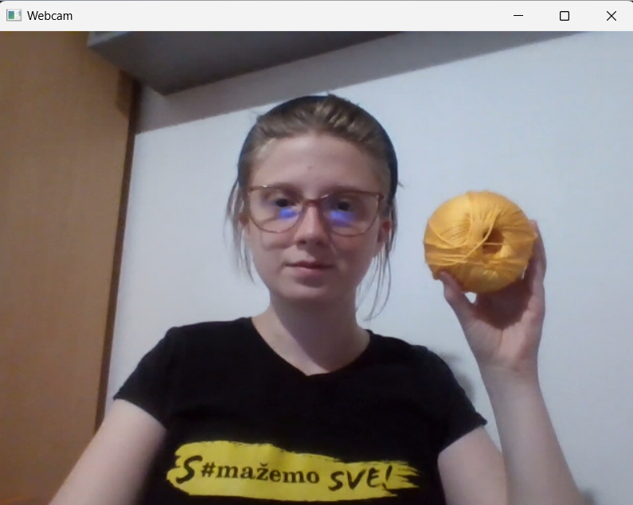
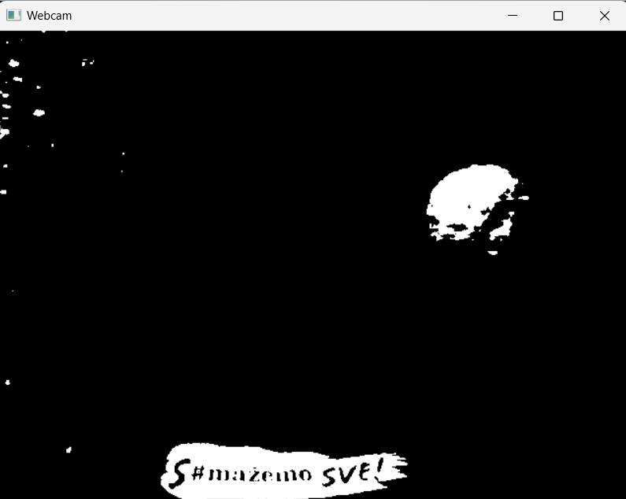

# Color Detection Mini-Project

The purpose of this mini-project was to detect the color yellow using only OpenCV operations.  

The crucial part here is the ***get_limits(color)*** function from `util.py` which gets the lower and upper limits whose purpose is to "slice" the hue wheel:

At the very beginning of `main.py` we defined the color we want, in this case it's yellow and we define it as (0, 255, 255) in BGR colorspace as *"pure yellow"*. Then when the webcam is on, each frame is first converted to the HSV colorspace, then after getting the limits from ***get_limits()*** they are used to get the mask. If we visualize the mask, this is how it behaves when yellow is detected:

  
  

As you can see, it detects in traces the yellow of the furniture in the background, it's not perfect but it does the trick. To finish, we just draw the rectangle from the detected bounding box. It works pretty well, even works with transparent yellow water bottle after struggling with it for a little while.

