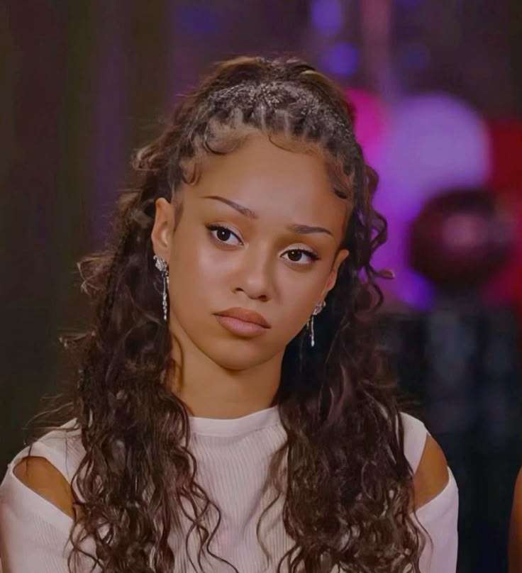
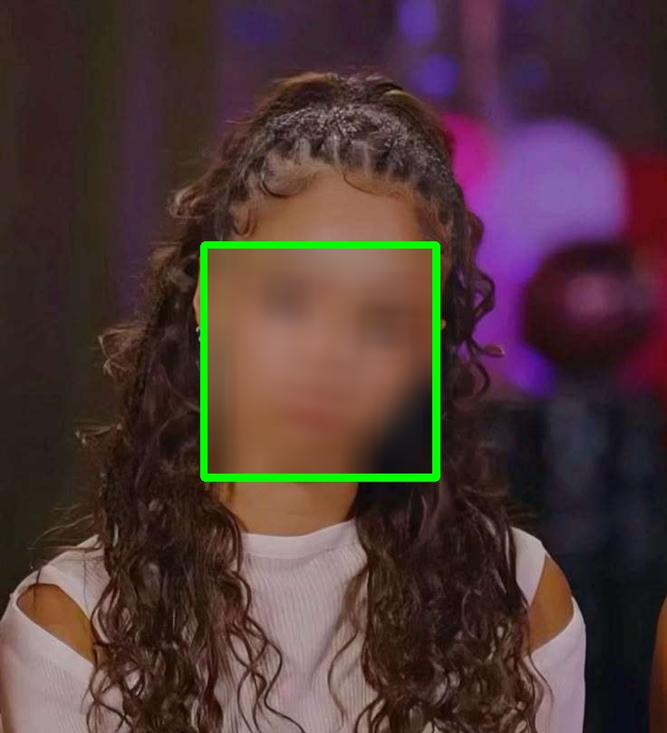

# Face Anonymizer Mini-Project

A tool for anonymizing faces with OpenCV and Mediapipe. It blurs a rectangle inside the bounding box of the detected face in an image (or frame of a video). *Note: Check dependencies before installing Mediapipe, it's possible you will have to downgrade Python to version 3.11.*

The code provided gives 3 options for media types: image, video, and webcam.  
* **image**: processes uploaded image with a provided path and outputs the result
* **video**: processes frames of the uploaded video with a provided path and outputs the result
* **webcam**: processes live frames while webcam is on, doesn't save the result anywhere

At the beginning of the `main.py` file, indicate one of the 3 in this line for the *mode* argument:

      args.add_argument("--mode", default='image') # image, video, or webcam

The next line requires you to provide the input path in case of **image** or **video**, if *mode* is **webcam** then indicate None

      args.add_argument("--filePath", default='./testvideo.mp4') # None if mode is webcam

The function **process_image(img, face_detection)** is imported from `util.py`. Here's a shallow dive into the function.

Parameter **img** is the source image (which is an imported image or frame from a video) and **face_detection** used in Mediapipe. After taking the source image, the function first converts it to RGB colorspace then starts the face detection process using the RGB image by calling `out = face_detection.process(img_rgb)`. You can print out `out.detections` to get parameters of the chosen image. The image chosen here *manon.jpg* will output these parameters:

      location_data {
        format: RELATIVE_BOUNDING_BOX
        relative_bounding_box {
          xmin: 0.311540812
          ymin: 0.340087682
          width: 0.337795764
          height: 0.3076832
        }
        relative_keypoints {
          x: 0.438506186
          y: 0.416636735
        }
        relative_keypoints {
          x: 0.574356675
          y: 0.451051
        }
        ...

There will be a few more relative keypoints pairs of coordinates, but from here we will only want to extract the relative bounding box and the 4 parameters xmin, ymin, width, and height. After extracting the 4 parameters, they will be then be multiplied by width or height of the source image (x and width are multiplied by the image width; y and height are multiplied by the image height).

You can choose to draw a rectangle around the found bounding box by having the starting(lower) coordinates to be (xmin, ymin) and ending(top) coordinates (xmin+width, ymin+height). This step is optional but it helps visualize the bounding box before blurring it.

The blurring process requires only one line using the blur function from cv2. The catch here is to cite the source image as a sliced list in all 3 dimensions—height, width, and channels (all 3 channels).

**The provided code plays around with the parameters of the functions, especially in *process_image()* where offset is introduced at the drawn rectangle so the boundaries of the rectangle don't get blurred, or the size of the blurred box to blur only the region of the eyes. Everything is explained in the comments in the code.** With offset for the rectangle to not be blurred in the process, this is how the output image will look like after anonymizing:

  
  

