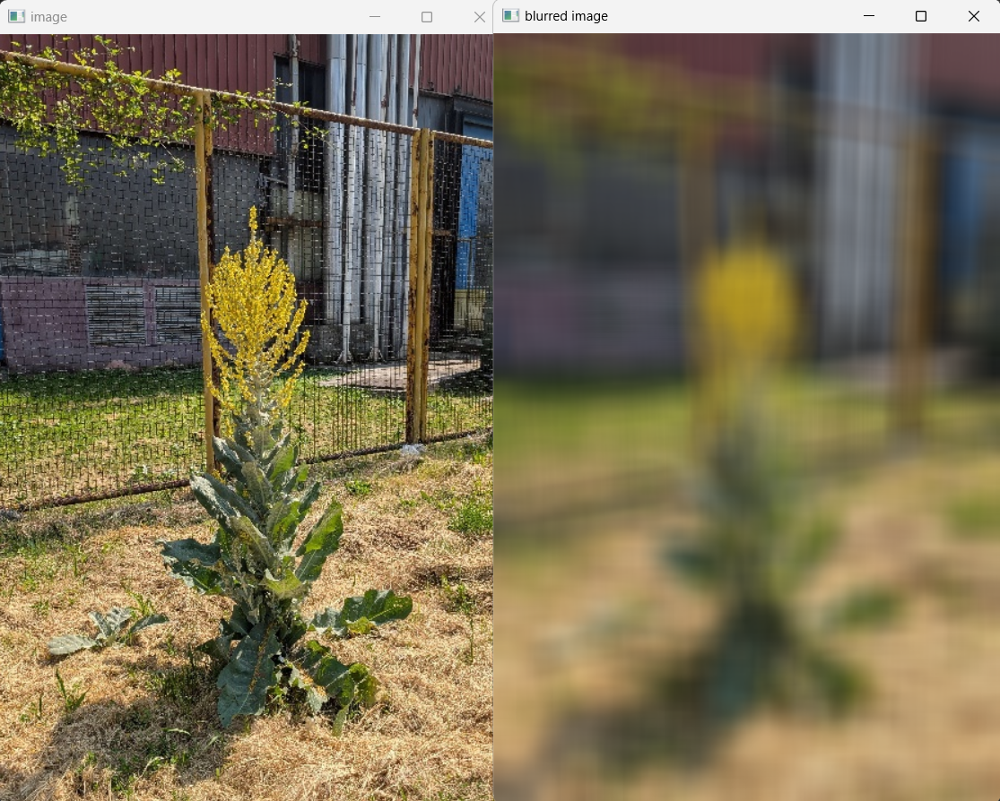
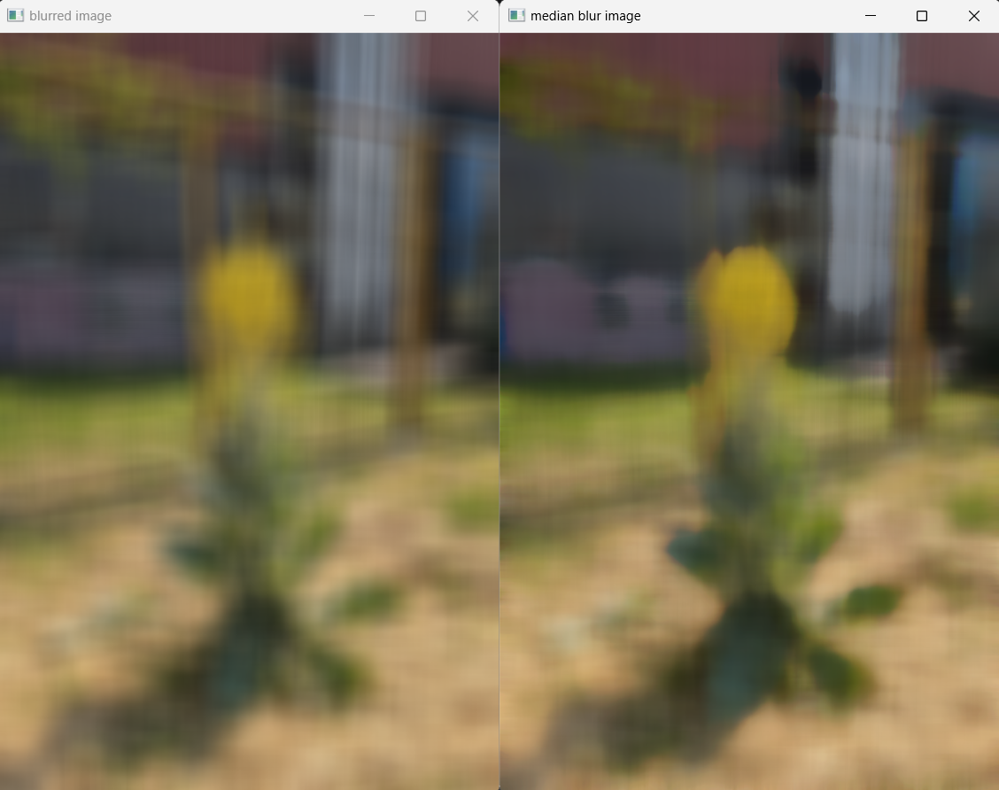

# PROJECT 1 - OpenCV Tutorial

Learning basic operations with images and video using the ***opencv-python*** library.
Based on [OpenCV tutorial for beginners | FULL COURSE in 3 hours with Python](https://youtu.be/eDIj5LuIL4A?si=gaCR-mjeaJiWvLNn) by *Computer vision engineer*. The video is used as a guideline to learn OpenCV, not copy and paste everything mentioned in the video. ***Will later go through the ["OpenCV bootcamp"](https://opencv.org/university/free-opencv-course/?utm_source=opcvu&utm_medium=menu&utm_campaign=obc) course that OpenCV offers for free and add the work here***.

### Prerequisites for Running the Code

First, install OpenCV locally by running `pip install opencv-python` on the terminal. The library that's used in the code is called **cv2**, thus when importing libraries, indicate `import cv2` at the top.

### Overview of the Provided Python Files

* `cv_image_operations.py` goes through the basic operations with images using the `cv2` library. The demo is done on the *image3.jpg* in this folder and uses the function *`show_coordinates`* from the `helper_functions1.py`. The operations done in this code are reading, writing, and showing the image, as well as cropping and resizing.

* `colorspaces.py` experiments with a few different color representations and the demo is done on the *yellow_flower.jpg* image. Running this code will save 3 files: *yellow_flower_rgb.jpg*, *yellow_flower_gray.jpg*, and *yellow_flower_hsv.jpg*.

* `blurring.py` works with 3 basic blur functions—blur, gaussian blurr, and median blur. The demo is done on *tall_flower.py* and it isn't set to save any additional files when running the code.

## Notes and Analysis

### Blurring

Important note about specifying the kernel size: cv2.GaussianBlur() requires the kernel size (k_size) to be a positive odd number (e.g., 3, 5, 7, etc.).  
Visual comparison between `blur`, `GaussianBlur`, and `medianBlur`. Kernel size (k_size) is set to 33, the third parameter in gaussian blur is set to 5. These are the outputs with the given parameters:

#### **Original vs blur**  

#### **blur vs GaussianBlur**  

#### **blur vs medianBlur**  

