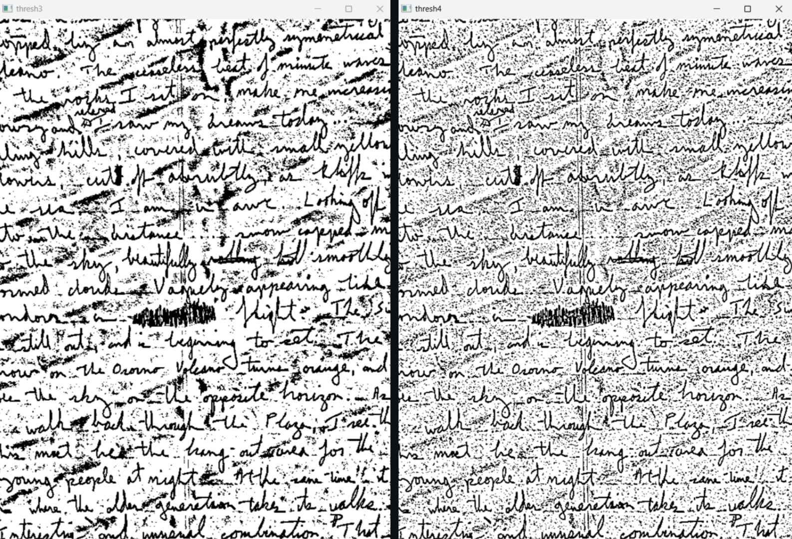

# PROJECT 1 - OpenCV Tutorial

Learning basic operations with images and video using the ***opencv-python*** library.
Based on [OpenCV tutorial for beginners | FULL COURSE in 3 hours with Python](https://youtu.be/eDIj5LuIL4A?si=gaCR-mjeaJiWvLNn) by *Computer vision engineer*. The video is used as a guideline to learn OpenCV, not copy and paste everything mentioned in the video. ***Will later go through the ["OpenCV bootcamp"](https://opencv.org/university/free-opencv-course/?utm_source=opcvu&utm_medium=menu&utm_campaign=obc) course that OpenCV offers for free and add the work here***.

In `demo` folder you can find all images that are saved by running the respective Python files (as listed in the README of `demo`).
The folder `fig` stores images used in this README, they're not obtained by running any code.

### Prerequisites for Running the Code

First, install OpenCV locally by running `pip install opencv-python` on the terminal. The library that's used in the code is called **cv2**, thus when importing libraries, indicate `import cv2` at the top.

### Overview of the Provided Python Files

* `cv_image_operations.py` goes through the basic operations with images using the `cv2` library. The demo is done on the *image3.jpg* in this folder and uses the function *`show_coordinates`* from the `helper_functions1.py`. The operations done in this code are reading, writing, and showing the image, as well as cropping and resizing.

* `colorspaces.py` experiments with a few different color representations and the demo is done on the *yellow_flower.jpg* image. Running this code will save 3 files: *yellow_flower_rgb.jpg*, *yellow_flower_gray.jpg*, and *yellow_flower_hsv.jpg*.

* `blurring.py` works with 3 basic blur functions—blur, gaussian blurr, and median blur. The demo is done on *tall_flower.py* and it isn't set to save any additional files when running the code.

## Notes and Analysis

### Blurring

Important note about specifying the kernel size: cv2.GaussianBlur() and cv2.medianBlur() require the kernel size (k_size) to be a positive odd number (e.g., 3, 5, 7, etc.). For cv2.blur() kernel size can be any integer, even though it's a standard to use odd integer.
Visual comparison between `blur`, `GaussianBlur`, and `medianBlur`. Kernel size (k_size) is set to 33, the third parameter in gaussian blur is set to 5. These are the outputs with the given parameters:

#### **Original vs blur**  

#### **blur vs GaussianBlur**  

#### **blur vs medianBlur**  

### Threshold

The image used here was `handwritten.png`. The provided code has a commented region where basic threshold was used and here's what it looks like with different values of threshold (80, 100, 127):

Since the basic threshold doesn't do well on slight lighting changes in the image, adaptive threshold is more suitable for this. The `adaptiveThreshold` function is used to apply adaptive thresholding to an image, which is particularly useful when lighting conditions vary across the image like we have in this case. Explanation of the parameters:

             cv2.adaptiveThreshold(src, maxValue, adaptiveMethod, thresholdType, blockSize, C)

* `src` is the input image in grayscale (it has to be in a singe channel)
  
* `maxValue` is the value assigned to pixels that satisfy the threshold condition (e.g., if a pixel value is above the threshold, it will be set to maxValue.
  
* `adaptiveMethod`: the method used was Adaptive Threshold Gaussian. There are 2 types of adaptive methods:
  1. `cv2.ADAPTIVE_THRESH_MEAN_C`: The threshold is the mean of the neighborhood area
  2. `cv2.ADAPTIVE_THRESH_GAUSSIAN_C`: The threshold is a weighted sum of the neighborhood values, where weights are from a Gaussian window
  
* `thresholdType` is the type of thresholding to apply. Common options:
  1. cv2.THRESH_BINARY: dst(x, y) = maxValue if src(x, y)>T(x, y) else 0
  2. cv2.THRESH_BINARY_INV: dst(x, y) = 0 if src(x, y)>T(x, y) else maxValue  

  Here, T(x, y) is the dynamically computed threshold for the pixel.

* `blockSize` is the size of the neighborhood (odd integer > 1) used to compute the threshold for each pixel. A larger block size means the threshold is computed over a larger area, which can smooth out local variations but may lose finer details.
* `C` is a constant subtracted from the computed threshold (can be positive, negative, or zero). This is used to fine-tune the threshold value. A higher C makes the threshold more "lenient," resulting in more pixels being classified as foreground.

#### **Higher C, different block sizes**

* thresh1 (blockSize=81) computes the threshold over a much larger neighborhood, making it less sensitive to local variations but potentially missing finer details. 
* thresh2 (blockSize=21) is more sensitive to local changes but may introduce more noise.

#### **Low C, different block sizes**

Since C is much smaller here, the threshold is less adjusted, resulting in a stricter binarization.

* thresh3 (blockSize=31) is smoother
* thresh4 (blockSize=11) preserves more details but also retains more noise.
  

